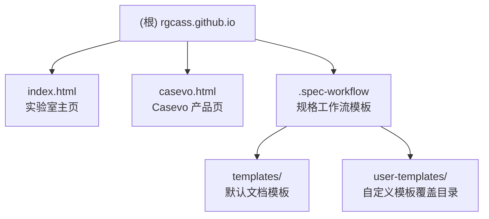

# rgCASS 官方网站 - AI 上下文索引

> 变更记录见文末。本文件由 AI 架构师自动生成，供 Claude Code 等 AI 工具快速理解项目全貌。

---

## 项目愿景

**rgCASS（智能体与社会仿真实验室）** 官方网站是一个纯静态个人学术主页/博客站点，托管于 GitHub Pages。网站面向学术同行、合作伙伴和招募对象，展示实验室的研究方向、开源工具（Casevo）及团队信息，目标是传达"用自然科学方法解决人文社科重大问题"的研究使命。

---

## 架构总览

本项目是极简的**纯静态 HTML 网站**，无构建工具、无前端框架、无后端服务：

- 语言：HTML + 原生 CSS（嵌入 `<style>`）+ 原生 JavaScript（嵌入 `<script>`）
- CSS 框架：Tailwind CSS（通过 CDN 引入，无本地安装）
- 字体：Google Fonts Noto Sans SC（CDN 引入，已注释，可选）
- 图标：Feather Icons SVG（内联）
- 动画：Canvas 粒子网络（原生 JS 实现，仅首页）
- 部署：GitHub Pages（静态托管）
- 无 package.json / 无 npm 脚本 / 无构建步骤

---

## 模块结构图



---

## 页面模块索引

| 页面文件 | 路径 | 一句话职责 |
|---|---|---|
| 实验室主页 | `index.html` | 实验室门户：研究方向、业务合作、团队构成、联系招聘 |
| Casevo 产品页 | `casevo.html` | 开源多智能体社会仿真工具 Casevo 的详细介绍与使用文档 |
| 规格工作流 | `.spec-workflow/` | AI 辅助需求/设计/任务文档的模板工具（非网站内容本身） |

---

## 运行与开发

### 本地预览

由于没有构建步骤，直接用浏览器打开 HTML 文件即可：

```bash
# 方式一：直接打开
open index.html

# 方式二：起一个本地静态服务（推荐，避免部分 CORS 问题）
python3 -m http.server 8080
# 然后访问 http://localhost:8080
```

### 部署

推送到 `main` 分支后，GitHub Pages 自动部署，无需额外操作。

### 分支策略

- `main`：生产分支，直接对应 GitHub Pages 发布内容
- `dev`：开发分支
- `feature/*`：功能分支，命名格式 `feature/B编号-功能名`（如 `feature/B004-cognitive-decoding`）

---

## 页面结构（两个页面共享设计规范）

### index.html - 实验室主页

五个全屏区段（Single Page Application 风格滚动）：

| 锚点 ID | 区段名称 | 主要内容 |
|---|---|---|
| `#hero` | 首屏 | Canvas 粒子动画 + 实验室名称与口号 |
| `#research` | 研究方向 | 四张卡片：认知解码、类人智能体、社会传播模拟器（链接到 casevo.html）、认知塑造 |
| `#cooperation` | 业务合作 | 2C（灵境社会）和 2B（课题合作）双栏展示 |
| `#team` | 团队构成 | 五位成员头像卡片 |
| `#recruitment` | 联系我们 | 招募信息 + 联系邮箱 rgcass@cuc.edu.cn |

### casevo.html - Casevo 产品页

六个内容区段：

| 锚点 ID | 区段名称 |
|---|---|
| `#hero` | Casevo 简介与 GitHub 链接 |
| `#features` | 核心特点（4 张特性卡）|
| `#functions` | 主要功能（6 张功能卡）|
| `#principles` | 技术原理（5 个技术模块）|
| `#operation` | 操作流程（3 个步骤）|
| `#applications` | 应用场景（4 张场景卡）|

---

## 编码规范

### CSS 设计令牌（两页共享）

```css
:root {
    --primary-blue: #0077ff;    /* 主色调 */
    --light-blue: #00aaff;      /* 辅助色 */
    --text-primary: #212529;    /* 主文字色 */
    --text-secondary: #5a6470;  /* 次要文字色 */
    --bg-light: #ffffff;        /* 白色背景 */
    --bg-off-white: #f8f9fa;    /* 浅灰背景 */
    --border-color: #dee2e6;    /* 边框色 */
}
```

### 通用组件类

| 类名 | 用途 |
|---|---|
| `.card` | 白色圆角卡片，悬停上移效果 |
| `.btn-primary` | 蓝色渐变按钮 |
| `.nav-link` | 导航链接，悬停蓝色下划线动画 |
| `.fade-in-section` | 滚动进入时淡入效果（IntersectionObserver）|
| `.tech-bg` | 点阵背景纹理 |
| `.section-title` | 蓝色区段标题 |
| `.main-title` | 深色主标题 |
| `.light-nav` | 毛玻璃效果导航栏 |

### 开发约定

1. 样式写在 `<style>` 标签内，不单独建 CSS 文件
2. 脚本写在 `<body>` 末尾 `<script>` 标签内，不单独建 JS 文件
3. 新页面必须沿用上述 CSS 变量和组件类，保持视觉一致性
4. 图片当前用 `placehold.co` 占位，上线前需替换为真实资源
5. 导航链接中的 `index_bright.html` 引用是历史遗留（casevo.html 中），正确目标应为 `index.html`
6. 版权年份当前写死为 2025，注意保持更新

---

## 测试策略

本项目为静态网页，无自动化测试框架。手动测试检查项：

- [ ] 桌面端与移动端响应式布局（Tailwind 断点：`md:` `lg:`）
- [ ] 移动菜单展开/收起功能
- [ ] 页面内锚点滚动定位
- [ ] Canvas 粒子动画在 resize 时重绘
- [ ] 滚动淡入效果（.fade-in-section）
- [ ] 所有外部链接（GitHub、邮箱）可正常跳转

---

## AI 使用指引

在此项目中与 AI 协作时，请注意：

1. **新增页面**：复制 `casevo.html` 作为模板，保留 `<head>` 中的样式变量和导航结构
2. **新增区段**：遵循现有 `<section>` 模式，提供 `id` 属性和 `fade-in-section` 类
3. **规格文档**：使用 `.spec-workflow/templates/` 中的模板创建需求/设计/任务文档
4. **不要引入 npm 包或构建工具**：本项目刻意保持零依赖构建
5. **内容占位符**：`[实验室具体地址]`、合作单位 Logo 等为待填内容，勿删除注释
6. **当前分支**：`feature/B004-cognitive-decoding`，此功能已被 Revert，处于待重做状态

---

## 变更记录 (Changelog)

| 日期 | 版本 | 说明 |
|---|---|---|
| 2026-03-22 | v1.0 | 初始化 AI 上下文文档，由 Claude Code 自动生成 |
