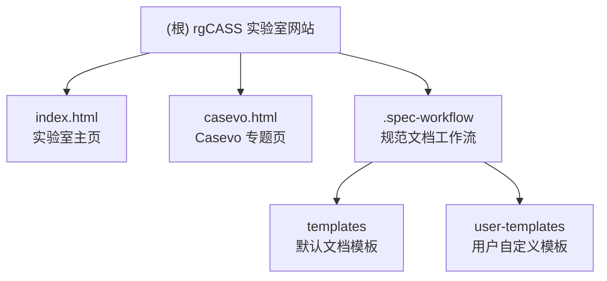

# CLAUDE.md - rgCASS 实验室网站 AI 上下文

## 变更记录 (Changelog)

| 版本 | 日期 | 说明 |
|------|------|------|
| v1.0 | 2026-03-22 | 初始化 AI 上下文，生成根级与模块级 CLAUDE.md，创建 .claude/index.json |
| v1.1 | 2026-03-23 | B005: 新增 psymem.html 类人智能体专题页，更新模块索引 |
| v1.2 | 2026-03-23 | 建立主页与认知解码、类人智能体专题页的双向链接 |

---

## 项目愿景

**rgcass.github.io** 是"智能体与社会仿真实验室"（rgCASS）的官方展示网站，托管于 GitHub Pages。网站使命是向学术界、产业界和公众介绍实验室在 AI+社会科学交叉领域的研究成果、开源工具与合作机会，支持实验室品牌建设与人才招募。

实验室核心方向：**认知解码 / 类人智能体 / 社会传播模拟器（Casevo）/ 认知塑造**，以自然科学方法解决人文社科重大问题。

---

## 架构总览

本项目是一个**纯静态 HTML 网站**，直接托管在 GitHub Pages 上，无构建工具、无后端服务、无包管理器。

- **渲染方式**：纯 HTML + 内联 CSS（Tailwind CSS CDN）+ 内联 JavaScript
- **字体**：Noto Sans SC（Google Fonts，当前已注释掉，降级至系统字体）
- **CSS 框架**：Tailwind CSS（通过 CDN 引入，无本地构建步骤）
- **动画**：原生 Canvas API（粒子连线背景动画）/ CSS transition / IntersectionObserver（滚动淡入）
- **图标**：Feather Icons（内联 SVG）
- **图片**：当前使用 placehold.co 占位图
- **部署**：git push 到 main/feature 分支后由 GitHub Pages 自动发布

```
rgcass.github.io/
├── index.html              # 实验室主页（唯一入口）
├── casevo.html             # Casevo 工具专题页
├── cognitive-decoding.html # 认知解码专题页
├── psymem.html             # 类人智能体(PsyMem)专题页
├── README.md               # 仓库说明（当前为空）
├── LICENSE                 # 开源许可证
└── .spec-workflow/         # 规范文档工作流工具（AI 辅助开发流程）
    ├── templates/          # 默认文档模板
    └── user-templates/     # 用户自定义模板（优先级高于默认）
```

---

## 模块结构图



---

## 模块索引

| 模块 | 路径 | 语言 | 职责简述 | 模块文档 |
|------|------|------|----------|----------|
| 实验室主页 | `index.html` | HTML/CSS/JS | 实验室官方门面，涵盖研究方向、业务合作、团队、招募 | [CLAUDE.md](./pages/index/CLAUDE.md) |
| Casevo 专题页 | `casevo.html` | HTML/CSS/JS | Casevo 多智能体模拟器产品介绍页，含特性、原理、操作流程 | [CLAUDE.md](./pages/casevo/CLAUDE.md) |
| 认知解码专题页 | `cognitive-decoding.html` | HTML/CSS/JS | 认知解码研究方向专题页，含研究内容、主要功能、应用场景 | — |
| 类人智能体专题页 | `psymem.html` | HTML/CSS/JS | PsyMem 类人智能体研究方向专题页，含研究内容、主要特点、应用场景 | — |
| 规范工作流 | `.spec-workflow/` | Markdown | AI 辅助规范文档流程（需求/设计/任务模板），不影响网站运行 | [CLAUDE.md](./.spec-workflow/CLAUDE.md) |

> **待规划模块**（当前分支 `feature/B004-cognitive-decoding` 曾添加后已 revert）：
> - `cognitive-decoding.html` — 认知解码专题页（B004 功能项，待重新开发）

---

## 运行与开发

### 本地预览

本项目无需任何构建步骤，直接在浏览器打开 HTML 文件即可：

```bash
# 方式一：直接用浏览器打开
open index.html

# 方式二：使用 Python 简易 HTTP 服务器（推荐，避免跨域问题）
cd /path/to/rgcass.github.io
python3 -m http.server 8080
# 访问 http://localhost:8080

# 方式三：使用 Live Server（VS Code 插件）
# 右键 index.html -> Open with Live Server
```

### 发布部署

```bash
git add .
git commit -m "描述变更"
git push origin main   # 推送到 main 分支后 GitHub Pages 自动发布
```

### 新建专题页

1. 复制 `casevo.html` 作为模板起点
2. 修改 `<title>`、页面内容区块
3. 检查导航链接（`href="index.html#section"`）确保回链正确
4. 在 `index.html` 的研究方向卡片中添加跳转链接
5. 提交并推送

---

## 测试策略

**当前状态**：无自动化测试（静态展示网站，无业务逻辑）

**手工验证清单**：
- [ ] 桌面端（1280px+）布局正常
- [ ] 移动端（375px/390px）响应式布局正常
- [ ] 移动菜单开合功能正常
- [ ] Hero 粒子动画加载正常
- [ ] 页面内锚点跳转正常（`#research`、`#team` 等）
- [ ] 跨页面链接正常（`casevo.html` 与 `index.html` 互链）
- [ ] 外部链接（GitHub、邮件）正确

---

## 编码规范

### HTML 结构
- 使用语义化 HTML5 标签（`<header>`、`<main>`、`<section>`、`<footer>`）
- 每个 `<section>` 设置唯一 `id`，与导航锚点对应
- 图片必须包含 `alt` 属性（无障碍访问）

### CSS 风格
- 优先使用 Tailwind 工具类；定制样式写在 `<style>` 块中的 `:root` CSS 变量
- 主色调变量：`--primary-blue: #0077ff`、`--light-blue: #00aaff`
- 卡片统一使用 `.card` 类（hover 效果：上移 10px + 蓝色阴影）
- 滚动动画统一使用 `.fade-in-section` 类 + IntersectionObserver

### JavaScript 风格
- 无框架，使用原生 DOM API
- 事件监听写在文件底部 `<script>` 块
- Canvas 动画在 `resize` 事件时重新初始化粒子

### 命名约定
- HTML 文件：`kebab-case.html`（如 `cognitive-decoding.html`）
- Section ID：`kebab-case`（如 `id="hero"`、`id="research"`）
- CSS 类：Tailwind 工具类优先；自定义类使用 `kebab-case`

---

## AI 使用指引

### 添加新页面时
- 保持 `<head>` 中 Tailwind CDN 和字体引用不变
- 导航返回链接格式：`href="index.html#section"`

### 修改主页内容时
- 研究方向卡片位于 `#research` section（第 163 行附近）
- 团队成员位于 `#team` section（第 241 行附近）
- 占位图（placehold.co）需在正式上线前替换为真实图片

### 不要做的事
- 不要引入 npm/Node.js 构建流程（除非有明确决策）
- 不要将 Tailwind CDN 替换为本地构建（除非性能需要）
- 不要修改 `.spec-workflow/templates/` 中的默认模板（使用 `user-templates/` 覆盖）

### 分支策略
- `main`：生产分支，GitHub Pages 发布源
- `dev`：开发集成分支
- `feature/BXXX-feature-name`：功能分支（如 `feature/B004-cognitive-decoding`）
